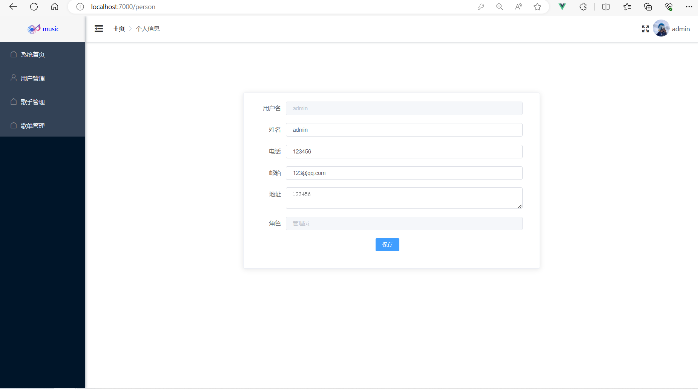
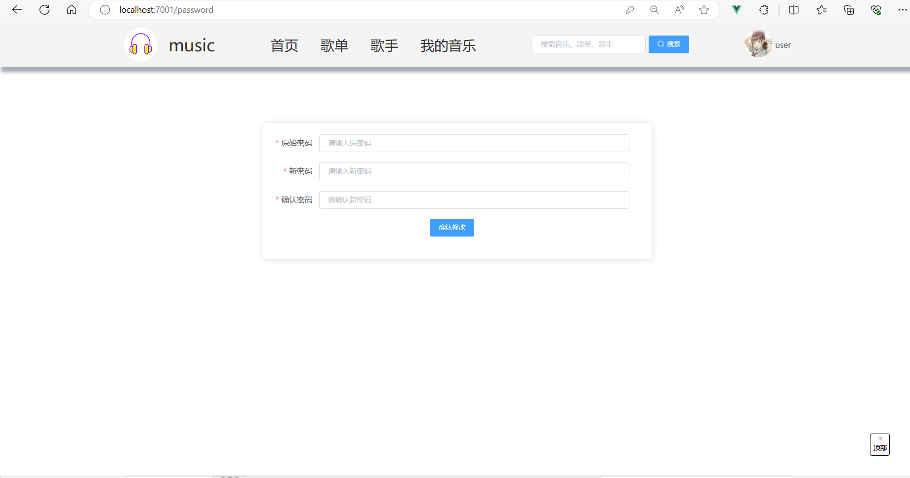

# music-website

### 项目介绍:

​		该项目是参考了B站上的 [【项目实战】手把手教你写一个基于springboot2+vue2.X的音乐网站(已完结)_哔哩哔哩_bilibili](https://www.bilibili.com/video/BV1Ck4y127cg/?spm_id_from=333.1007.top_right_bar_window_default_collection.content.click&vd_source=df5835b3fadf1e8558914f9c6670d900) 视频，并根据自己的实际情况做了些更改优化。十分感谢王汉远老师的视频！

​		

### 项目功能:

##### 客户端：

- 音乐网站的登录、注册、身份认证（使用的JWT）
- 音乐的播放、暂停、播放模式切换、歌曲进度切换以及音量控制
- 收藏音乐与取消收藏音乐
- 歌词显示并随歌曲进度滚动（目前滚动效果还很差，后面技术进步后会试着优化）
- 播放列表显示
- 根据关键字搜索歌曲、歌手、歌单
- 用户信息编辑、头像修改、密码修改
- 歌单列表、歌手列表分页显示
- 实现了音乐下载

##### 后台管理端：

- 管理员的登录、身份认证
- 对用户的管理
- 对用户收藏的歌曲管理
- 对歌手的管理
- 对歌手对应歌曲的管理
- 对歌单的管理
- 对歌单对应歌曲的管理
- 实现了文件的上传与预览
- 对歌词文件.lrc文件进行读取，并将结果返回给前端解析歌词
- 访问后台数据请求接口需要携带token才能访问
- 使用 Echarts 完成了一些数据统计可视化


### 技术栈：

##### 后端：

SpringBoot+Mybatis-Plus

##### 前端：

Vue2.0 + Vue-Router + Vuex + Axios + ElementUI + Echarts 


### 项目环境：

- JDK：jdk15
- MySQL：mysql8.0
- Maven：maven-3.3.9
- node：node - 18.19.0
- vue/cli：@vue/cli 5.0.8
-  IDE：IntelliJ IDEA 2022、VSCode 


### 运行项目：

 - **修改数据库配置：**在music文件下的application.yml中修改成自己的数据库配置

   

- **导入数据库文件：**导入sql文件到数据库中

- **将静态资源放入下面的目录下**

  

- **启动管理端：**在IDEA中将music后台启动，启动前导入pom.xml中的依赖

- **启动后台管理端：** 进入 music-manage 目录，运行下面命令 

  ```cmd
  npm install // 安装依赖
  npm run serve // 启动后台管理项目
  ```

- **启动客户端：**进入 music-client 目录，运行下面命令

  ```cmd
  npm install // 安装依赖
  npm run serve // 启动前台项目
  ```

- **登录后台管理端：**
  - 用户名：admin
  - 密码：123（数据库存的是后端加密后的）
- **登录客户端：**
  - 用户名：user
  - 密码：123（数据库存的是后端加密后的）

### 预览：

后台管理端：





客户端：




### 项目总结：

​		本人是一个前端小白，初入前端不久，当前的能力十分有限。对于项目中的一些bug或其他问题暂时没有发现或者目前还没有能力去解决它，并且项目中有很多功能复用了但没有将这些功能分离成一个独立的vue组件，这些都是我以后需要去优化的方向和不断学习下去的动力。同时，这也是我的本科毕设，尽管它还有很多的不足，但却是对我这两个月努力的一种成果展示，同时，当前项目的结束也代表着我的大学生涯的结束，代表着我的人生进入到了下一个阶段，未来的人生走向将由自己来决定了。最后，由衷的希望在以后的日子里，我对于前端的学习能够持续下去，而不会中途放弃吧！

